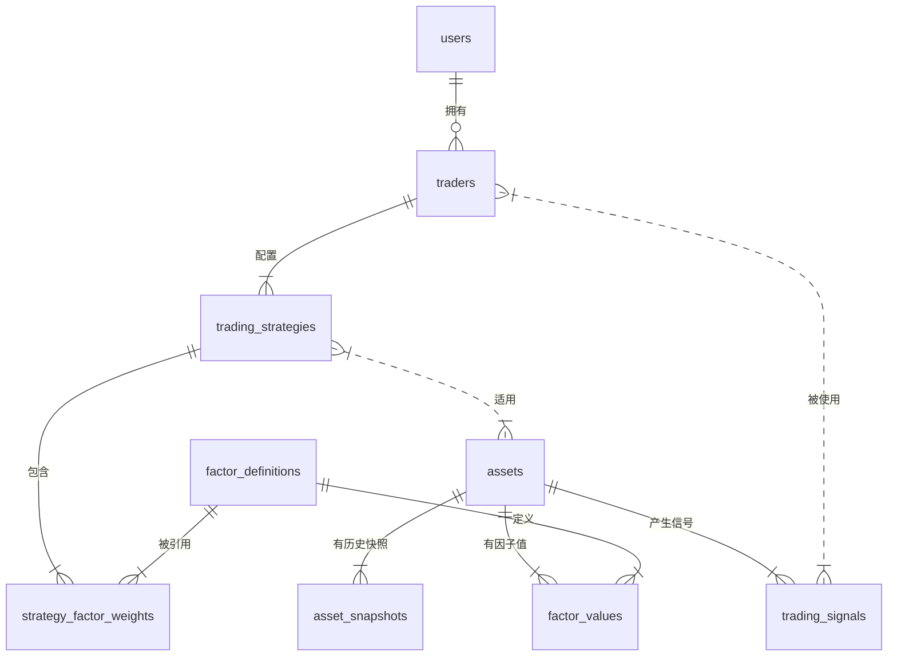

# SmartTrader 数据库设计文档

## 1. 数据库概览

SmartTrader 数据库采用 PostgreSQL 14+，包含 10 个核心表，遵循以下设计原则：

- **领域驱动设计 (DDD)**: 表结构反映业务领域概念（如 Trader、TradingStrategy、TradingSignal）
- **规范化设计**: 避免数据冗余，使用外键关联建立表间关系
- **可扩展性**: 支持动态因子定义和策略配置
- **性能优化**: 为频繁查询字段建立适当索引
- **分析友好**: 保存完整的历史数据快照和因子值序列

---

## 2. 详细表结构

### 2.1 users (用户表)

| 字段名               | 类型          | 约束           | 说明                     |
|---------------------|---------------|----------------|--------------------------|
| id                  | bigint        | PRIMARY KEY    | 主键                     |
| google_id           | string        | UNIQUE, INDEX  | Google OAuth 用户ID     |
| email               | string        | NOT NULL, UNIQUE, INDEX | 邮箱地址         |
| email_verified      | boolean       | DEFAULT false  | 邮箱验证状态             |
| name                | string        | NOT NULL       | 用户姓名                 |
| avatar_url          | string        |                | 头像URL                  |
| created_at          | datetime      | NOT NULL       | 创建时间                 |
| updated_at          | datetime      | NOT NULL       | 更新时间                 |

**索引**:
- `index_users_on_email_and_google_id (email, google_id)` (复合唯一索引)
- `index_users_on_email` (唯一索引)
- `index_users_on_google_id` (唯一索引)

**关联关系**:
- 无直接外键关联（当前设计）

---

### 2.2 traders (操盘手表)

| 字段名               | 类型          | 约束           | 说明                     |
|---------------------|---------------|----------------|--------------------------|
| id                  | bigint        | PRIMARY KEY    | 主键                     |
| user_id             | bigint        | NOT NULL, FOREIGN KEY | 用户ID          |
| name                | string        | NOT NULL       | 操盘手名称               |
| description         | text          |                | 操盘手描述（投资风格）   |
| initial_capital     | decimal(15,2) | NOT NULL, DEFAULT 100000.0 | 初始资金       |
| current_capital     | decimal(15,2) |                | 当前资金                 |
| risk_level          | integer       | DEFAULT 0      | 风险等级 (0:保守, 1:平衡, 2:激进) |
| status              | integer       | DEFAULT 0      | 状态 (0:活跃, 1:停用)   |
| created_at          | datetime      | NOT NULL       | 创建时间                 |
| updated_at          | datetime      | NOT NULL       | 更新时间                 |

**索引**:
- `index_traders_on_user_id`
- `index_traders_on_status`

**关联关系**:
- `belongs_to :user`
- `has_many :trading_strategies`

**枚举值**:
- risk_level: { conservative: 0, balanced: 1, aggressive: 2 }
- status: { active: 0, inactive: 1 }

---

### 2.3 trading_strategies (交易策略表)

| 字段名                  | 类型          | 约束           | 说明                     |
|------------------------|---------------|----------------|--------------------------|
| id                     | bigint        | PRIMARY KEY    | 主键                     |
| trader_id              | bigint        | NOT NULL, FOREIGN KEY | 操盘手ID        |
| name                   | string        | NOT NULL       | 策略名称                 |
| market_condition       | integer       | NOT NULL, DEFAULT 0 | 市场条件 (0:正常, 1:高波动, 2:崩盘, 3:泡沫) |
| risk_level             | integer       | DEFAULT 1      | 风险等级 (同traders表)   |
| max_positions          | integer       | DEFAULT 3      | 最大持仓数 (2-5)         |
| buy_signal_threshold   | decimal(3,2)  | DEFAULT 0.5, CHECK (0.3-0.7) | 买入信号阈值 |
| max_position_size      | decimal(3,2)  | DEFAULT 0.5, CHECK (0.3-0.7) | 单仓位最大占比 |
| min_cash_reserve       | decimal(3,2)  | DEFAULT 0.2, CHECK (0.05-0.4) | 最小现金储备 |
| generated_by           | integer       | DEFAULT 0      | 策略生成方式 (0:LLM, 1:手动, 2:默认模板, 3:矩阵) |
| description            | text          |                | 策略描述                 |
| created_at             | datetime      | NOT NULL       | 创建时间                 |
| updated_at             | datetime      | NOT NULL       | 更新时间                 |

**索引**:
- `index_trading_strategies_on_trader_id_and_market_condition (trader_id, market_condition)` (复合唯一索引)

**关联关系**:
- `belongs_to :trader`
- `has_many :strategy_factor_weights`

**枚举值**:
- market_condition: { normal: 0, volatile: 1, crash: 2, bubble: 3 }
- generated_by: { llm: 0, manual: 1, default_template: 2, matrix: 3 }

---

### 2.4 assets (资产表)

| 字段名               | 类型          | 约束           | 说明                     |
|---------------------|---------------|----------------|--------------------------|
| id                  | bigint        | PRIMARY KEY    | 主键                     |
| symbol              | string        | NOT NULL, INDEX | 资产代码 (如 BTC, AAPL) |
| name                | string        | NOT NULL       | 资产名称                 |
| asset_type          | string        | NOT NULL       | 资产类型 (stock/crypto/etf等) |
| exchange            | string        | NOT NULL, DEFAULT 'UNKNOWN' | 交易所/市场 (BINANCE, NASDAQ, SSE等) |
| quote_currency      | string        | NOT NULL, DEFAULT 'USD' | 计价货币 (USDT, USD, CNY等) |
| coingecko_id        | string        | INDEX          | CoinGecko 币种 ID (仅加密货币) |
| yahoo_symbol        | string        | INDEX          | Yahoo Finance Symbol (如 BTC-USD, AAPL) |
| current_price       | decimal(15,2) |                | 当前价格                 |
| last_updated        | datetime      |                | 价格最后更新时间         |
| active              | boolean       | DEFAULT true, INDEX | 是否活跃交易         |
| created_at          | datetime      | NOT NULL       | 创建时间                 |
| updated_at          | datetime      | NOT NULL       | 更新时间                 |

**索引**:
- `index_assets_on_symbol_exchange_quote (symbol, exchange, quote_currency)` (复合唯一索引)
- `index_assets_on_coingecko_id` (唯一索引，仅加密货币)
- `index_assets_on_yahoo_symbol` (唯一索引，仅股票)
- `index_assets_on_asset_type`
- `index_assets_on_active`

**关联关系**:
- `has_many :asset_snapshots, dependent: :destroy`
- `has_many :factor_values, dependent: :destroy`
- `has_many :trading_signals, dependent: :destroy`

---

### 2.5 asset_snapshots (资产快照表)

| 字段名               | 类型          | 约束           | 说明                     |
|---------------------|---------------|----------------|--------------------------|
| id                  | bigint        | PRIMARY KEY    | 主键                     |
| asset_id            | bigint        | NOT NULL, FOREIGN KEY | 资产ID          |
| snapshot_date       | date          | NOT NULL, INDEX | 快照日期（用于查询和唯一性约束） |
| captured_at         | datetime      | NOT NULL, INDEX | 实际采集时间（精确时间戳） |
| price               | decimal(15,2) | NOT NULL       | 资产价格                 |
| change_percent      | decimal(8,4)  |                | 价格涨跌幅 (%)           |
| volume              | decimal(20,2) |                | 成交量                   |
| created_at          | datetime      | NOT NULL       | 创建时间                 |
| updated_at          | datetime      | NOT NULL       | 更新时间                 |

**索引**:
- `index_asset_snapshots_on_asset_id_and_snapshot_date (asset_id, snapshot_date)` (复合唯一索引)
- `index_asset_snapshots_on_snapshot_date`
- `index_asset_snapshots_on_captured_at`

**关联关系**:
- `belongs_to :asset`

**关联关系**:
- `belongs_to :asset`

---

### 2.6 candles (K线数据表)

| 字段名               | 类型          | 约束           | 说明                     |
|---------------------|---------------|----------------|--------------------------|
| id                  | bigint        | PRIMARY KEY    | 主键                     |
| asset_id            | bigint        | NOT NULL, FOREIGN KEY | 资产ID          |
| interval            | string        | NOT NULL, DEFAULT '4h' | 时间周期 (1m/5m/15m/1h/4h/1d/1w) |
| candle_time         | datetime      | NOT NULL, INDEX | K线开始时间             |
| open_price          | decimal(15,2) | NOT NULL       | 开盘价                   |
| high_price          | decimal(15,2) | NOT NULL       | 最高价                   |
| low_price           | decimal(15,2) | NOT NULL       | 最低价                   |
| close_price         | decimal(15,2) | NOT NULL       | 收盘价                   |
| volume              | decimal(20,2) |                | 成交量                   |
| quote_volume        | decimal(20,2) |                | 成交额                   |
| created_at          | datetime      | NOT NULL       | 创建时间                 |
| updated_at          | datetime      | NOT NULL       | 更新时间                 |

**索引**:
- `index_candles_on_asset_id_and_interval_and_candle_time (asset_id, interval, candle_time)` (复合唯一索引)
- `index_candles_on_candle_time`
- `index_candles_on_asset_id_and_interval`

**关联关系**:
- `belongs_to :asset`

**业务说明**:
- 主要用于4小时K线监控和技术分析
- 支持多种时间周期，但默认使用4小时（4h）
- 用于计算技术指标：MACD、RSI、布林带等
- 存储策略：4小时线保留1-2年，日线长期保留

---

### 2.7 trading_signals (交易信号表)

| 字段名               | 类型          | 约束           | 说明                     |
|---------------------|---------------|----------------|--------------------------|
| id                  | bigint        | PRIMARY KEY    | 主键                     |
| asset_id            | bigint        | NOT NULL, FOREIGN KEY | 资产ID          |
| signal_type         | string        | NOT NULL, INDEX | 信号类型 (buy/sell/hold) |
| generated_at        | datetime      | NOT NULL       | 信号生成时间             |
| confidence          | decimal(3,2)  |                | 信号置信度 (0-1)         |
| reasoning           | text          |                | LLM 推理过程             |
| risk_warning        | text          |                | 风险提示                 |
| key_factors         | jsonb         | DEFAULT []     | 关键因子列表             |
| factor_snapshot     | jsonb         | DEFAULT {}     | 因子值快照               |
| created_at          | datetime      | NOT NULL       | 创建时间                 |
| updated_at          | datetime      | NOT NULL       | 更新时间                 |

**索引**:
- `index_trading_signals_on_asset_id_and_generated_at (asset_id, generated_at)` (复合索引)
- `index_trading_signals_on_asset_id`
- `index_trading_signals_on_signal_type`

**关联关系**:
- `belongs_to :asset`

**枚举值**:
- signal_type: buy, sell, hold

---

### 2.8 factor_definitions (因子定义表)

| 字段名               | 类型          | 约束           | 说明                     |
|---------------------|---------------|----------------|--------------------------|
| id                  | bigint        | PRIMARY KEY    | 主键                     |
| code                | string        | NOT NULL, UNIQUE, INDEX | 因子代码 (如 'rsi') |
| name                | string        | NOT NULL       | 因子名称                 |
| category            | string        | NOT NULL, INDEX | 因子类别 (technical/fundamental/sentiment等) |
| calculation_method  | string        | NOT NULL       | 计算方法                 |
| formula             | text          |                | 计算公式（可选）         |
| description         | text          |                | 因子描述                 |
| weight              | decimal(5,4)  | DEFAULT 0.1, CHECK (0-1) | 因子权重         |
| active              | boolean       | DEFAULT true, INDEX | 是否启用             |
| parameters          | jsonb         | DEFAULT {}     | 参数配置 (JSON格式)      |
| update_frequency    | integer       | DEFAULT 60     | 更新频率 (秒)            |
| sort_order          | integer       | DEFAULT 0      | 排序顺序                 |
| created_at          | datetime      | NOT NULL       | 创建时间                 |
| updated_at          | datetime      | NOT NULL       | 更新时间                 |

**索引**:
- `index_factor_definitions_on_code` (唯一索引)
- `index_factor_definitions_on_category`
- `index_factor_definitions_on_active`

**关联关系**:
- `has_many :factor_values, dependent: :destroy`
- `has_many :strategy_factor_weights, dependent: :destroy`

**因子类别**:
- technical (技术因子)
- fundamental (基本面因子)
- sentiment (情绪因子)
- momentum (动量因子)
- risk (风险因子)
- volume (成交量因子)

---

### 2.9 factor_values (因子值表)

| 字段名               | 类型          | 约束           | 说明                     |
|---------------------|---------------|----------------|--------------------------|
| id                  | bigint        | PRIMARY KEY    | 主键                     |
| asset_id            | bigint        | NOT NULL, FOREIGN KEY | 资产ID          |
| factor_definition_id| bigint        | NOT NULL, FOREIGN KEY | 因子定义ID      |
| calculated_at       | datetime      | NOT NULL, INDEX | 计算时间                 |
| raw_value           | decimal(15,6) |                | 原始值                   |
| normalized_value    | decimal(10,6) |                | 标准化值 (-1 到 1)       |
| percentile          | decimal(5,2)  |                | 分位数 (0-100)           |
| created_at          | datetime      | NOT NULL       | 创建时间                 |
| updated_at          | datetime      | NOT NULL       | 更新时间                 |

**索引**:
- `idx_factor_values_unique (asset_id, factor_definition_id, calculated_at)` (复合唯一索引)
- `index_factor_values_on_asset_id`
- `index_factor_values_on_factor_definition_id`
- `index_factor_values_on_calculated_at`

**关联关系**:
- `belongs_to :asset`
- `belongs_to :factor_definition`

---

### 2.10 strategy_factor_weights (策略因子权重表)

| 字段名               | 类型          | 约束           | 说明                     |
|---------------------|---------------|----------------|--------------------------|
| id                  | bigint        | PRIMARY KEY    | 主键                     |
| trading_strategy_id | bigint        | NOT NULL, FOREIGN KEY | 策略ID          |
| factor_definition_id| bigint        | NOT NULL, FOREIGN KEY | 因子定义ID      |
| weight              | decimal(5,4)  | DEFAULT 0.1, CHECK (0-1) | 因子权重         |
| created_at          | datetime      | NOT NULL       | 创建时间                 |
| updated_at          | datetime      | NOT NULL       | 更新时间                 |

**索引**:
- `index_strategy_factor_weights_on_trading_strategy_id`
- `index_strategy_factor_weights_on_factor_definition_id`

**关联关系**:
- `belongs_to :trading_strategy`
- `belongs_to :factor_definition`

---

## 3. 表关联关系图



---

## 4. 设计建议

### 4.1 当前设计的优点

1. **清晰的领域模型映射**: 表结构直接反映业务概念
2. **强大的策略配置**: 支持3×4矩阵的预设策略和动态生成策略
3. **灵活的因子系统**: 支持12种因子类别和自定义计算方法
4. **完整的历史记录**: 保存资产价格快照和因子值序列
5. **性能优化**: 为高频查询建立了适当索引

### 4.2 改进建议

#### 4.2.1 缺失的核心表

**1. positions (持仓表)**
```sql
CREATE TABLE positions (
    id bigint PRIMARY KEY,
    trader_id bigint NOT NULL REFERENCES traders,
    asset_id bigint NOT NULL REFERENCES assets,
    quantity decimal(15,6) NOT NULL,
    average_cost decimal(15,2) NOT NULL,
    current_value decimal(15,2) NOT NULL,
    pnl decimal(15,2) NOT NULL,
    pnl_percent decimal(5,2) NOT NULL,
    created_at timestamptz NOT NULL,
    updated_at timestamptz NOT NULL,
    UNIQUE(trader_id, asset_id)
);
```

**2. transactions (交易记录表)**
```sql
CREATE TABLE transactions (
    id bigint PRIMARY KEY,
    trader_id bigint NOT NULL REFERENCES traders,
    asset_id bigint NOT NULL REFERENCES assets,
    transaction_type smallint NOT NULL, -- 0:买入, 1:卖出
    quantity decimal(15,6) NOT NULL,
    price decimal(15,2) NOT NULL,
    total_amount decimal(15,2) NOT NULL,
    fee decimal(15,2) DEFAULT 0,
    signal_id bigint REFERENCES trading_signals,
    executed_at timestamptz NOT NULL,
    created_at timestamptz NOT NULL
);
```

#### 4.2.2 现有表优化建议

1. **users 表**: 添加 `timezone` 和 `locale` 字段支持多语言和时区
2. **traders 表**: 添加 `performance_metrics` JSONB 字段存储历史绩效统计
3. **trading_strategies 表**: 添加 `backtest_result` JSONB 字段存储回测结果
4. **trading_signals 表**: 添加 `expiration_time` 字段支持信号有效期管理
5. **asset_snapshots 表**: 添加 `market_cap` 和 `volume` 字段完善市场数据

#### 4.2.3 索引优化

1. 为 `positions(trader_id, current_value)` 建立复合索引支持持仓价值排序
2. 为 `transactions(trader_id, executed_at)` 建立复合索引支持交易历史查询
3. 为 `trading_signals(generated_at)` 建立降序索引优化最新信号查询

---

## 5. 版本控制

- **v1.0.0** (2026-03-05): 初始版本，包含核心业务表
- **v1.0.1** (2026-03-06): 优化 assets 表结构，支持多交易所和多数据源
  - 添加 `exchange`, `quote_currency` 字段支持多交易所和计价货币
  - 添加 `coingecko_id`, `yahoo_symbol` 字段对接外部数据源 API
  - 添加 `active` 字段管理资产状态
  - 调整唯一索引为复合索引 `(symbol, exchange, quote_currency)`
- **v1.1.0**: 计划添加 positions 和 transactions 表

---

## 6. 维护说明

1. 使用 `rails db:migrate` 管理数据库变更
2. 定期清理旧的 `asset_snapshots` 和 `factor_values` 记录以节省空间
3. 为大表（如 factor_values）考虑分区存储策略
4. 使用只读副本处理分析查询负载
